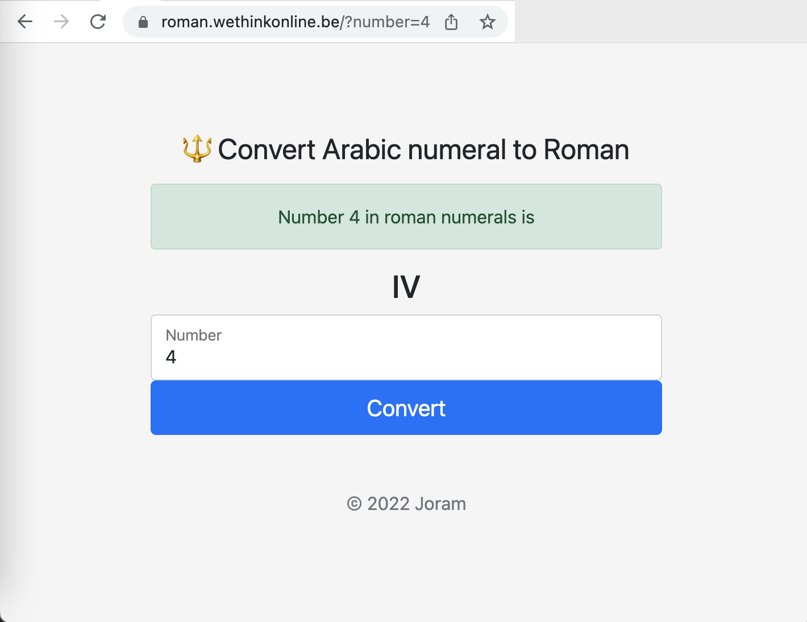

# Roman
PHP web application to convert arabic numerals to roman.

## Build and test
Prerequisites are yarn & docker. Then run:

    yarn encore dev
    docker build . -t roman && docker run -p  8082:80 roman
    open -a "Google Chrome" http://localhost:8082/ 
    
## Demo application
https://roman.wethinkonline.be/
